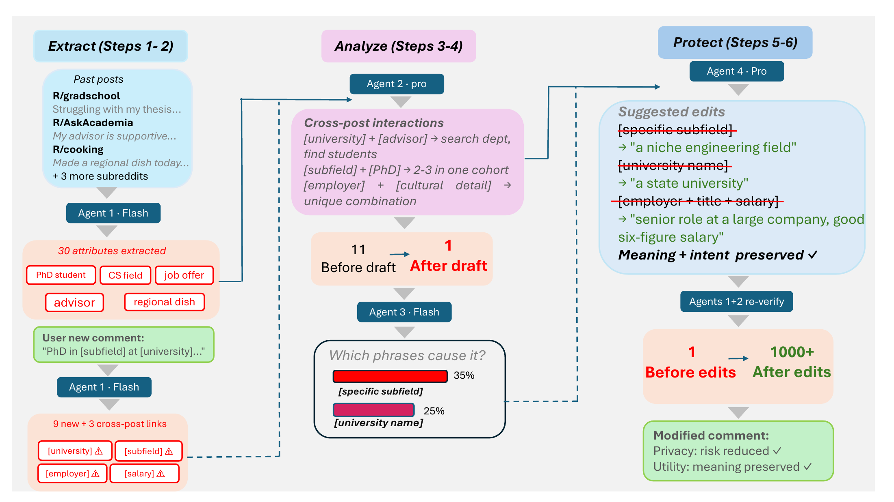

# CLOAK

**Understand what your next post could reveal.**

**Accepted at ACM UIST 2026 · Top 8% of submissions out of 1251 total.**

[Conference review-score statistics](https://uist.acm.org/2026/announcements/)

CLOAK is an experimental privacy-awareness assistant. Give it your own posting history and a draft you are considering sharing. It examines how details across those texts may combine, explains potentially revealing phrases, and suggests edits for you to review.

[Read the paper](docs/CLOAK-paper.pdf) · [Paper DOI](https://doi.org/10.1145/3830398.3830723) · [Responsible use](RESPONSIBLE_USE.md)

> **For experimentation and personal privacy awareness only.** Use your own text, the fictional example, or material shared with informed consent for this analysis. Do not use CLOAK to stalk, identify, locate, monitor, or deanonymize other people, or to profile social media users at scale. Public availability of a post is not consent to analyze its author.

## How it works



Four agents examine the history and draft, analyze combinations of details, highlight phrases, and propose edits. The pipeline then reassesses the suggested draft. You decide what to change or publish; CLOAK does not publish posts for you.

*The diagram is from the paper. Its example counts and percentages are model estimates, not verified counts of real people or guarantees of protection. [View the diagram as a PDF](docs/assets/architecture.pdf).*

## Get started

You need Git, Python 3.10 or later, and a Gemini API key. This implementation uses Google's Gemini API; another provider's key is not a drop-in replacement.

### 1. Clone the repository

Clone the public repository:

```bash
git clone https://github.com/Sandeep945-pixel/CLOAK.git CLOAK
cd CLOAK
```

If you downloaded the ZIP, extract it and open a terminal inside its `CLOAK` folder instead.

### 2. Install the dependency

**macOS / Linux**

```bash
python3 -m venv .venv
source .venv/bin/activate
python -m pip install -r requirements.txt
```

**Windows PowerShell**

```powershell
py -m venv .venv
.\.venv\Scripts\python.exe -m pip install -r requirements.txt
```

### 3. Set your API key

Create your own key in [Google AI Studio](https://aistudio.google.com/apikey). Set it in the same terminal you will use to run CLOAK. Keep your key private and never commit it.

**macOS / Linux**

```bash
export GEMINI_API_KEY="YOUR_API_KEY"
```

**Windows PowerShell**

```powershell
$env:GEMINI_API_KEY="YOUR_API_KEY"
```

No source-code change is needed. `.env.example` is a configuration reference; the program does not automatically read `.env` files. See the [official Google SDK documentation](https://googleapis.github.io/python-genai/) for API setup.

### 4. Try the fictional example

**macOS / Linux**

```bash
python pipeline.py examples/fictional/history.txt examples/fictional/draft.txt outputs/demo-01
```

**Windows PowerShell**

```powershell
.\.venv\Scripts\python.exe pipeline.py examples/fictional/history.txt examples/fictional/draft.txt outputs/demo-01
```

The supplied example is fictional. An uncached run makes seven model calls; charges and model availability depend on your API account. Live API execution has not been verified for this distribution.

### 5. Read the suggestions

Open these local files:

- `outputs/demo-01/user_report.txt` — explanations and suggested edits.
- `outputs/demo-01/edited_draft.txt` — the proposed draft for your review.
- `outputs/demo-01/user_report.json` — the structured report.

Check every suggestion for meaning and accuracy. An edit may fail to reduce risk or may reveal more than the original. No output establishes that a post is safe or anonymous.

## Try your own text

Create `history.txt` and `draft.txt` inside a local `data/my-example/` folder. Use only your own text or material provided with informed consent. Then run:

```bash
python pipeline.py data/my-example/history.txt data/my-example/draft.txt outputs/my-example-01
```

On Windows, use `.\.venv\Scripts\python.exe` in place of `python`.

**Choose a new output folder whenever you change the history or model configuration.** The current implementation reuses an existing profile in the output folder without checking whether those inputs changed.

## Model configuration

Defaults: `gemini-2.5-flash` for extraction and phrase analysis; `gemini-2.5-pro` for interaction analysis and editing. If your account requires different Gemini models, set `CLOAK_FLASH_MODEL` and `CLOAK_PRO_MODEL` to model IDs available to your account.

macOS / Linux syntax:

```bash
export CLOAK_FLASH_MODEL="YOUR_FLASH_MODEL_ID"
export CLOAK_PRO_MODEL="YOUR_PRO_MODEL_ID"
```

Windows PowerShell syntax:

```powershell
$env:CLOAK_FLASH_MODEL="YOUR_FLASH_MODEL_ID"
$env:CLOAK_PRO_MODEL="YOUR_PRO_MODEL_ID"
```

Changing models can change output quality. Supporting a different API provider requires a code adapter and validation, not just a different key.

## Privacy and responsible use

Inputs and intermediate text are sent to the configured Gemini service. This is not an offline-only tool. Local output folders also retain input-derived profiles, logs, and raw model responses. Use fictional text for initial experiments, avoid submitting material you are not authorized to share, and delete local outputs when no longer needed. `.gitignore` excludes the standard data and output folders; it does not prevent other applications from copying them.

CLOAK is intended to help people understand their own exposure. Stalking, doxxing, harassment, surveillance, identity tracing, unauthorized profiling, and mass deanonymization are prohibited uses under this project's responsible-use policy. The policy is a use restriction, not a technical mechanism that prevents misuse.

**Experimental software; provided “as is,” without warranties.** Outputs can be inaccurate, incomplete, or misleading. Users are responsible for their inputs, permissions, use of outputs, and resulting actions. To the extent permitted by applicable law, the authors and contributors disclaim liability for misuse and resulting harm. See [RESPONSIBLE_USE.md](RESPONSIBLE_USE.md).

## Learn more

Read [CLOAK: A Privacy-Preserving Assistant for Online Social Media Users](docs/CLOAK-paper.pdf) (ACM UIST 2026) for the research background. The paper contains its reported findings; this demo distribution does not include evaluation scripts, research datasets, participant responses, study materials, or raw evaluation results.

Sandeep Kalari · Mohan Sunkara · Vikas Ashok · Ravi Mukkamala  
Old Dominion University
